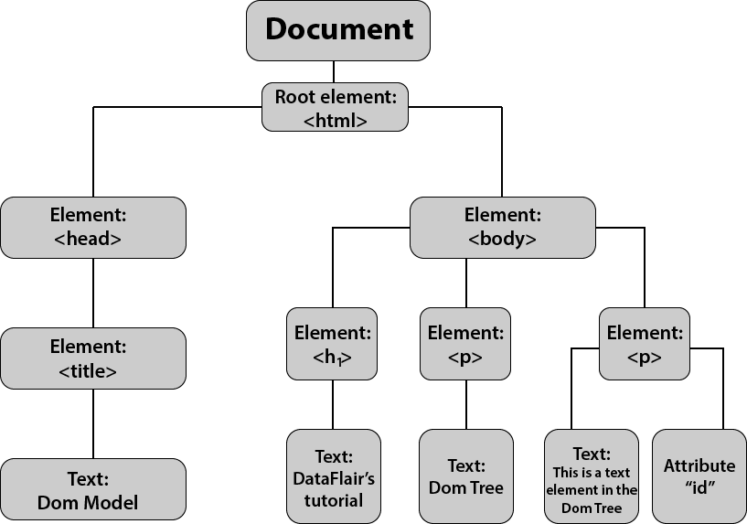

<p  align="center">
    
</p>
<h2 align="center"><strong>NEWBIE JAVASCRIPT CHEAT SHEETS</strong></h2>

# Document Object Model (DOM)

## 1. Introduction

It's all the `HTML` document structure. It is not javascript, it is an application programing interface (`API`) that allows us to work with `HTML`, using `JavaScript`.



> This is the DOM representation of the following HTML document.
>
> ```html
> <!DOCTYPE html>
> <html>
>   <head>
>     <title>Dom Model</title>
>   </head>
>   <body>
>     <h1>DataFlair's tutorial</h1>
>     <p>Dom Tree</p>
>     <p id="text">
>       This is a text element in the Dom Tree
>     </p>
>   </body>
> </html>
> ```

## 2. Nodes

The parts of the `DOM` are called `nodes`. There are different types of nodes; the most important are: `element nodes`, `text nodes` and `comment nodes`.

- **Element nodes:** It's the number 1. It represents any `HTML` tag.
- **Text node:** It' is the number 3. It represents any content inside a tag.
- **Comment node:** It' is the number 8. It represents any comment in the HTML document.
