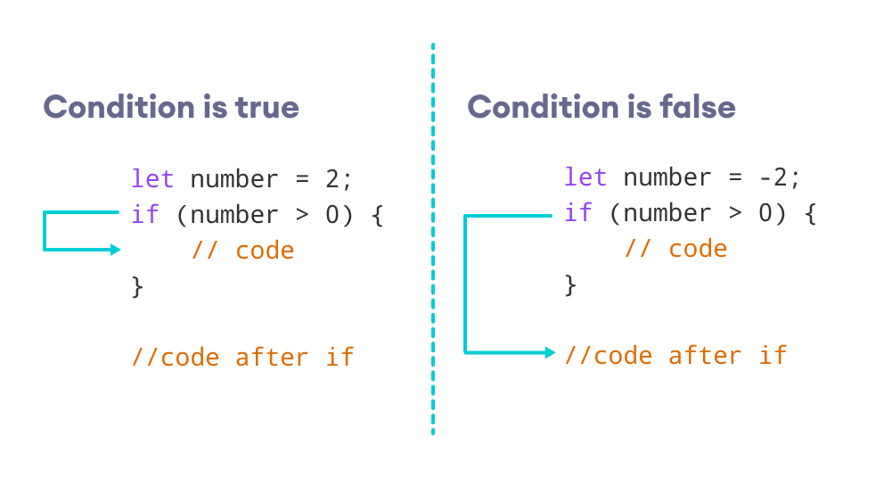
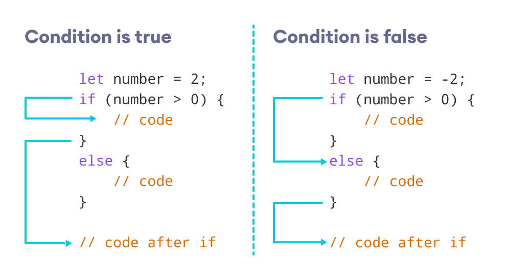
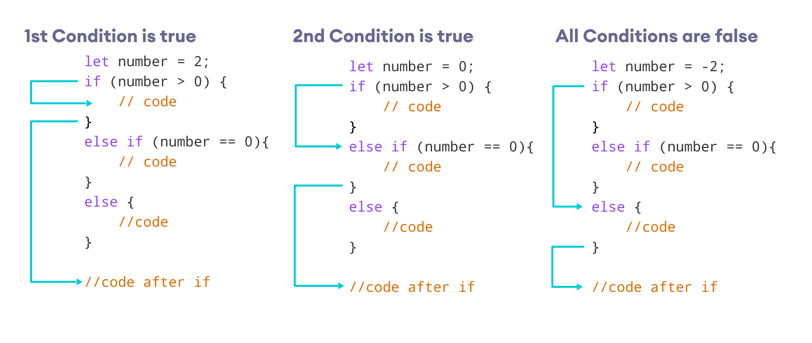

# JavaScript Conditionals

## 1. Introduction

Conditional statements control behavior in JavaScript and determine whether or not pieces of code can run.

There are multiple different types of conditionals in JavaScript including:

- `If` statements: where if a condition is true it is used to specify execution for a block of code.
- `Else` statements: where if the same condition is false it specifies the execution for a block of code.
- `Else if` statements: this specifies a new test if the first condition is false.

## 2. If Statement

As the most common type of conditional, the `if` statement only runs if the condition enclosed in parentheses `()` is truthy.

<p align="center">
  
</p>

```js
if (10 > 5) {
  console.log("if block"); // Output: if block
}
```

## 3. Else Statement

You can extend an if statement with an `else`statement, which adds another block to run when the if conditional doesn’t pass.

<p align="center">
  
</p>

```js
if (10 < 5) {
  console.log("if block");
} else {
  console.log("else block"); // Output: else block
}
```

## 4. Else if Statement

You can also extend an if statement with an `else if` statement, which adds another conditional with its own block.

<p align="center">
  
</p>

```js
if (10 < 5) {
  console.log("if block");
} else if (10 > 5) {
  console.log("else if block"); // Output: else if block
} else {
  console.log("else block");
}
```
