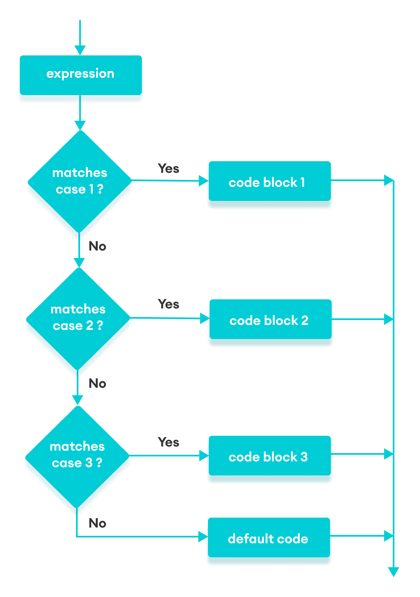

# JavaScript Switch Statement

## 1. Introduction

The JavaScript `switch` statement is used in decision making.

The `switch` statement evaluates an expression and executes the corresponding body that matches the expression's result.

#### Switch Flowchart



## 2. Switch

```js
switch (variable / expression) {
  case value1:
    // body of case 1
    break;

  case value2:
    // body of case 2
    break;

  case valueN:
    // body of case N
    break;

  default:
  // body of default
}
```

The `switch` statement evaluates a variable/expression inside parentheses ().

- If the result of the expression is equal to `value1`, its body is executed.
- If the result of the expression is equal to `value2`, its body is executed.
- This process goes on. If there is no matching case, the `default` body executes.

> **Notes:**
>
> - The `break` statement is optional. If the break statement is encountered, the switch statement ends.
> - If the `break` statement is not used, the cases after the matching case is also executed.
> - The `default` clause is also optional. It can also be declared inside in the beginning or in the middle of the switch block.

## 3. Multiple Switch

In a JavaScript `switch` statement, cases can be grouped to share the same result.

```js
// multiple case switch program
let fruit = "apple";
switch (fruit) {
  case "apple":
  case "mango":
  case "pineapple":
    console.log(`${fruit} is a fruit.`);
    break;
  default:
    console.log(`${fruit} is not a fruit.`);
    break;
}
```
